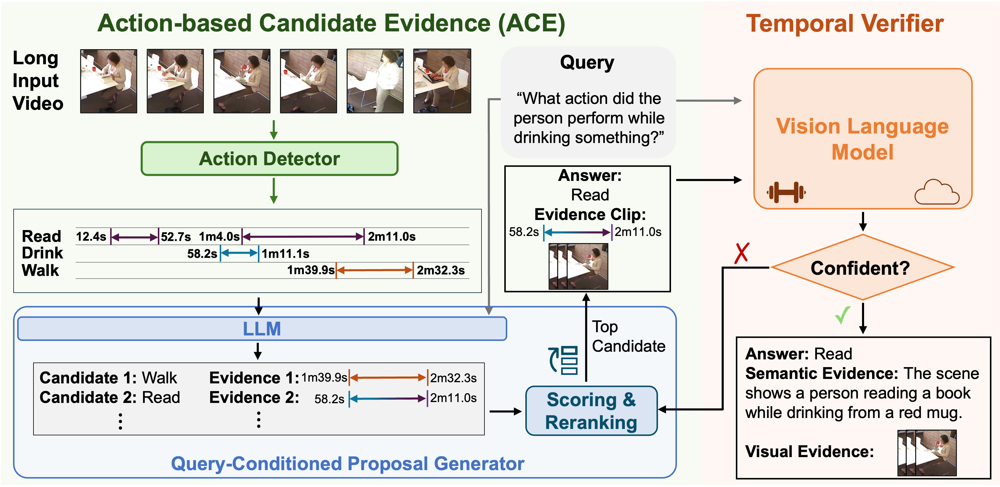

<div align="center">
<h1 align="center">TɪᴍᴇPʀᴏVᴇ: Propose, then Verify for Efficient Long Video Temporal Reasoning in Activities of Daily Living</h1>

<p>
  <a href="https://arxiv.org/abs/2606.20561">
    
  </a>
  <a href="https://huggingface.co/datasets/thearkaprava/OpenTSUBench/tree/main">
    
  </a>
</p>
</div>

Long Video Question Answering (LVQA) requires identifying sparse, query-relevant evidence within hours-long untrimmed videos. Existing approaches either process videos densely with large vision-language models (VLMs), incurring prohibitive computational cost, or rely on sparse caption-based reasoning, which often misses temporally localized and motion-centric evidence. We introduce **TɪᴍᴇPʀᴏVᴇ**, a cost-efficient hybrid framework for temporally grounded reasoning in long videos. TɪᴍᴇPʀᴏVᴇ first employs lightweight modules to generate action-grounded answer–evidence hypotheses and subsequently invokes an expensive VLM only for targeted verification. The core of our framework lies in the **Action-based Candidate Evidence (ACE)** module, which converts temporally localized actions into query-conditioned candidate answers and supporting evidence windows through lightweight LLM reasoning. We further introduce **OPENTSUBENCH (OTB)**, an open-ended benchmark designed to evaluate temporally grounded reasoning in real-world Activities of Daily Living (ADL) scenarios. Experiments show that TɪᴍᴇPʀᴏVᴇ outperforms the strongest baseline on OTB by 7.3%, while reducing VLM calls by 75% and inference cost by 93%. Furthermore, without explicit temporal grounding training, TɪᴍᴇPʀᴏVᴇ achieves competitive performance on CHARADES-STA, and reaches state-of-the-art results when enhanced with grounding VLMs.

## Overview

TɪᴍᴇPʀᴏVᴇ follows a **propose → verify** design:

1. **Propose (lightweight):** MS-Temba action-detection scores are thresholded into a per-video action timeline. A text-only LLM (ACE) ranks temporal windows by query relevance, proposes tentative answers from action labels and timestamps, and selects which short clips merit VLM inspection.
2. **Verify (targeted VLM):** For each candidate window, a short clip is extracted and passed to a VLM for query-conditioned description and final answer generation. A lightweight confidence check decides whether to stop or continue to the next window.

<p align="center">
  
</p>

## Prepare the environment

TɪᴍᴇPʀᴏVᴇ builds on [VideoLLaMA 3](https://github.com/DAMO-NLP-SG/VideoLLaMA3) for local VLM inference. Use the same dependency stack:

**Basic requirements**

- Python >= 3.10
- PyTorch >= 2.4.0
- CUDA >= 11.8
- `transformers` >= 4.46.3

**Install (recommended)**

```bash
git clone https://github.com/thearkaprava/TimeProVe.git
cd TimeProVe

# PyTorch + CUDA 11.8
pip install torch==2.4.0 torchvision==0.19.0 --extra-index-url https://download.pytorch.org/whl/cu118

# Flash-attention (match torch 2.4 + cu118)
pip install flash-attn==2.7.3 --no-build-isolation --upgrade

# Project dependencies
pip install -r requirements.txt
```

> **Note:** For CUDA 11.8 with `torch==2.4.0`, use `flash-attn==2.7.3`. If you use a different Python or CUDA build, pick a compatible wheel from the [flash-attention releases](https://github.com/Dao-AILab/flash-attention/releases/).

**Optional (GPT + Gemma pipeline)**

- An [OpenAI API key](https://platform.openai.com/) for GPT-4o clip description and verification
- A local [Ollama](https://ollama.com/) server if you use the default LLM-based accuracy evaluator (`evaluate_accuracy_llm_parse.py`)

## Prepare the data

### Videos (Toyota Smarthome Untrimmed / TSU)

Download the **Toyota Smarthome Untrimmed** dataset following [MS-Temba](https://github.com/thearkaprava/MS-Temba):

- Request access and download from the [Toyota Smarthome project page](https://project.inria.fr/toyotasmarthome/).

Organize videos so each file is named `<video_id>.mp4` (e.g. `P02T01C06.mp4`). Point `OTB_VIDEO_ROOT` at that directory:

```bash
export OTB_VIDEO_ROOT=/path/to/smarthome/untrimmed/Videos_mp4
```

### OTB benchmark annotations (included)

This repository ships OTB metadata under `data/`:

| File | Description |
|------|-------------|
| `data/otb_bench.json` | OTB questions, ground-truth answers, and evidence metadata |
| `data/smarthome.json` | TSU ground-truth action annotations |
| `data/TSU_Action_list.txt` | Action class index → name mapping for the AD predictor |

Example OTB record (`data/otb_bench.json`):

```json
{
  "P02T01C06": {
    "video_id": "P02T01C06",
    "subset": "testing",
    "candidates": [
      {
        "candidate_id": "P02T01C06_c025",
        "question": "What did the person do after make coffee pour water?",
        "answer": "Use_Drawer",
        "qa_category": "Temporal Positioning"
      }
    ]
  }
}
```

### MS-Temba action-detection predictions

TɪᴍᴇPʀᴏVᴇ expects per-frame MS-Temba predictions as a pickle file keyed by `video_id`:

```bash
# Default path used by the run scripts
data/TSU_best_AD.pkl
```

Train [MS-Temba](https://github.com/thearkaprava/MS-Temba) on TSU and export frame-level detection scores, or place your own compatible `.pkl` at `data/TSU_best_AD.pkl` and set `PKL_PATH` accordingly. Each entry should be a `(num_classes, num_time_bins)` probability array; `data/TSU_Action_list.txt` maps class indices to action names.

### VideoLLaMA 3 checkpoint (local VLM pipeline)

For `scripts/run_TimeProVe_qwen_vlma3.sh`, provide a VideoLLaMA 3 checkpoint (Hugging Face id or local path):

```bash
export MODEL_PATH=DAMO-NLP-SG/VideoLLaMA3-7B
# or a converted local checkpoint:
# export MODEL_PATH=/path/to/videollama3_7b_local
```

See [VideoLLaMA 3 model zoo](https://github.com/DAMO-NLP-SG/VideoLLaMA3#earth_americas-model-zoo) for official weights.

## Run TɪᴍᴇPʀᴏVᴇ on OTB

Two end-to-end drivers are provided under `scripts/`. Both shard work across GPUs, write per-question JSON under a workdir, merge results, and run accuracy evaluation.

### Option A — Qwen as the LLM and VideoLLaMA3 as the VLM

Uses a local VideoLLaMA 3 model for clip description and final QA; lightweight text-only reasoning uses the same backbone in text-only mode.

```bash
export OTB_VIDEO_ROOT=/path/to/smarthome/untrimmed/Videos_mp4
export MODEL_PATH=/path/to/videollama3_7b_local
export GPU_IDS=0,1,2,3,4,5,6,7
export WORKDIR=workdirs/OTB_vlma3_run

bash scripts/run_TimeProVe_qwen_vlma3.sh 
```

### Option B — Gemma as the LLM + GPT-4o as the VLM

Uses **Gemma** for lightweight propose/confidence steps and **GPT-4o** only on selected clips.

```bash
export OPENAI_API_KEY=sk-...
export OTB_VIDEO_ROOT=/path/to/smarthome/untrimmed/Videos_mp4
export MODEL_PATH=google/gemma-4-E2B-it    # text-only LLM checkpoint (any compatible HF model)
export GPT_VLM_MODEL=gpt-4o
export GPU_IDS=0,1,2,3,4,5,6,7
export WORKDIR=workdirs/OTB_gemma_gpt4o_run

bash scripts/run_TimeProVe_Gemma_GPT.sh
```

Smaller GPT model for cheaper verification:

```bash
export OPENAI_API_KEY=sk-...
export OTB_VIDEO_ROOT=/path/to/smarthome/untrimmed/Videos_mp4
export MODEL_PATH=google/gemma-4-E2B-it    # text-only LLM checkpoint (any compatible HF model)
export GPT_VLM_MODEL=gpt-4o-mini
export GPU_IDS=0,1,2,3,4,5,6,7
export WORKDIR=workdirs/OTB_gemma_gpt4omini_run

bash scripts/run_TimeProVe_Gemma_GPT.sh
```

### Output layout

After a run, `WORKDIR` contains:

```bash
WORKDIR/
├── prepared_inputs/
│   └── otb_mstemba_samples.json    # flat question list fed to the pipeline
├── s3_llm_final_ans/
│   └── <question_id>.json          # one file per question
├── merged.json                     # merged predictions (after eval step)
└── final_results.json              # accuracy summary
```


## Evaluate

The shell drivers call `scripts/merge_jsons_n_eval_otb.sh` automatically when a run finishes. You can also run evaluation on an existing workdir:

```bash
export WORKDIR=workdirs/OTB_vlma3_run
bash scripts/merge_jsons_n_eval_otb.sh
```

Or manually:

```bash
cd evaluation

python eval_merge_topk_output_jsons.py \
  -i ../workdirs/OTB_vlma3_run/s3_llm_final_ans \
  -o ../workdirs/OTB_vlma3_run/merged.json

python evaluate_accuracy_llm_parse.py \
  -i ../workdirs/OTB_vlma3_run/merged.json \
  -o ../workdirs/OTB_vlma3_run/final_results.json
```

`evaluate_accuracy_llm_parse.py` uses a local Ollama model to judge whether each free-form prediction supports the reference OTB label (paraphrases allowed). Ensure Ollama is running, or inspect `merged.json` directly.

## Project structure

```bash
TimeProVe/
├── assets/
│   └── timeprove_arch.png          # framework diagram
├── data/
│   ├── otb_bench.json            # OTB benchmark
│   ├── smarthome.json            # TSU GT annotations
│   ├── TSU_Action_list.txt       # action vocabulary
│   └── TSU_best_AD.pkl           # temporal action detection with frame-level detections
├── evaluation/
│   ├── TimeProVe_qwen_vlma3.py   # VideoLLaMA 3 pipeline
│   ├── TimeProVe_Gemma_GPT.py    # Gemma + GPT pipeline
│   ├── agent_utils.py            # ACE / temporal window logic
│   └── evaluate_accuracy_llm_parse.py
├── scripts/
│   ├── run_TimeProVe_qwen_vlma3.sh
│   ├── run_TimeProVe_Gemma_GPT.sh
│   └── merge_jsons_n_eval_otb.sh
└── videollama3/                  # VideoLLaMA 3 inference code
```

## Citation

```bibtex
@misc{sinha2026timeprove,
      title={TimeProVe: Propose, then Verify for Efficient Long Video Temporal Reasoning in Activities of Daily Living}, 
      author={Arkaprava Sinha and Dominick Reilly and Siddharth Krishnan and Hieu Le and Srijan Das},
      year={2026},
      eprint={2606.20561},
      archivePrefix={arXiv},
      primaryClass={cs.CV},
      url={https://arxiv.org/abs/2606.20561}, 
}
```

## Acknowledgement

TɪᴍᴇPʀᴏVᴇ builds on [MS-Temba](https://github.com/thearkaprava/MS-Temba) for temporally localized action proposals, [VideoLLaMA 3](https://github.com/DAMO-NLP-SG/VideoLLaMA3) for efficient video-language inference, and the [Toyota Smarthome Untrimmed](https://project.inria.fr/toyotasmarthome/) dataset. We thank the authors for their open-source contributions.
